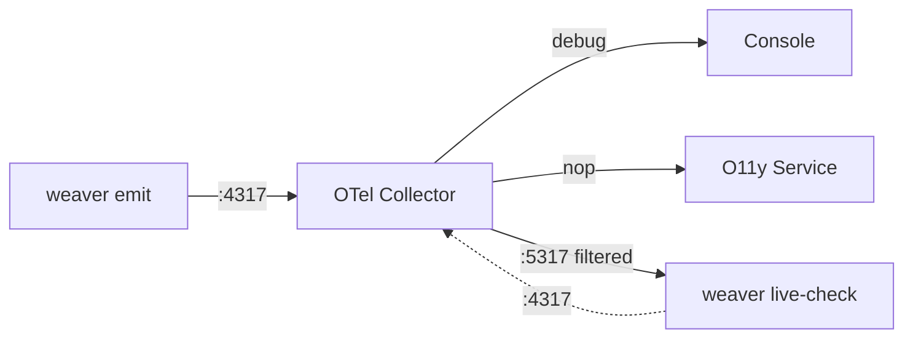

# Weaver OTLP Logs Emitter

Since version 0.20, `weaver registry live-check` can emit Findings as OTLP logs. This, combined with options to support continuous monitoring, makes it possible to integrate Weaver Findings into existing observability pipelines within testing or staging environments.

This example demonstrates how to set up the OpenTelemetry Collector to receive example telemetry emitted by `weaver registry emit` and forward them to a running `weaver registry live-check` instance for processing.

## Telemetry Flow



**Configuration:**
- **Collector receives**: OTLP on :4317 (gRPC) and :4318 (HTTP)
- **Collector exports to**:
  - `debug`: Console with detailed verbosity
  - `nop/o11yservice`: No-op exporter (placeholder for your O11y service)
  - `otlp/weaver`: Weaver live-check on :5317 (filtered for `^weaver` events, no TLS, no compression)
- **Weaver live-check**: Receives on :5317, processes, sends back Findings to collector on :4317

## ⚠️ Important: OpenTelemetry Collector Configuration to Prevent Loops

**A vital part of this setup is ensuring that the OTel Collector does not create an infinite loop by sending Findings back to `weaver`.** This is achieved by filtering the logs sent to the `weaver` exporter to exclude any with an event name starting with `weaver`.

## Usage

```sh
# Change to the directory containing this README
cd emit_otlp_logs

# Start live check listening for OTLP:
#   --otlp-grpc-port=5317 -> listen on gRPC port 5317
#   --emit-otlp-logs -> emit logs for any Findings (defaults to gRPC 4317)
#   --inactivity-timeout=0 -> never timeout
#   --output=none -> do not output to console
#   --no-stats -> disable stats collection
#   -r ../basic/model -> use the basic example model for live-check rules
weaver registry live-check --otlp-grpc-port=5317 --emit-otlp-logs --inactivity-timeout=0  --output=none --no-stats -r ../basic/model

# In another terminal, run the OpenTelemetry Collector with the provided config (this assumes you have otelcol installed and in your PATH)
otelcol --config=otelcol.yaml

# In a third terminal, run the weaver emit command to send telemetry from the basic example model to the collector
weaver registry emit -r ../basic/model
```

You should see telemetry emitted by the `weaver registry emit` command being processed by the OTel Collector and displayed in the console output. When live-check detects Findings, it will emit them as logs back to the collector. An example of a Finding in the console output is shown below:

```
LogRecord #1
ObservedTimestamp: 2025-12-20 02:34:44.076746 +0000 UTC
Timestamp: 1970-01-01 00:00:00 +0000 UTC
SeverityText: WARN
SeverityNumber: Warn(13)
EventName: weaver.live_check.finding
Body: Str(Attribute 'host.arch' is not stable; stability = development.)
Attributes:
     -> weaver.finding.id: Str(not_stable)
     -> weaver.finding.level: Str(improvement)
     -> weaver.finding.sample_type: Str(attribute)
     -> weaver.finding.signal_type: Str(metric)
     -> weaver.finding.signal_name: Str(example.counter)
     -> weaver.finding.context.attribute_name: Str(host.arch)
     -> weaver.finding.context.stability: Str(development)
Trace ID: 
Span ID: 
Flags: 0
```

## Observability Integration
A no-op exporter is configured in this example as a placeholder for integrating with your observability service. You can replace it with an appropriate exporter configuration.

This will complete the setup and allow you to see how Weaver Findings can be emitted as OTLP logs and integrated into your observability pipeline.